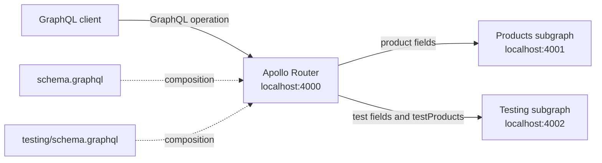

# Federation Architecture

## Current and proposed topology



The current product subgraph is implemented by the root `schema.graphql`,
`src/index.ts`, and `src/resolvers/`. The new testing subgraph is an independent
Apollo Server under `testing/`.

## Request flow

For this operation:

```graphql
query ProductWithTestFields {
  product(id: "1") {
    id
    name
    description
    testStatus
    testScore
  }
}
```

1. The client sends one request to Apollo Router on port `4000`.
2. Router sends `id`, `name`, and `description` to the products subgraph.
3. Router sends the `Product` representation to the testing subgraph.
4. The testing subgraph resolves `testStatus` and `testScore` through
   `Product.__resolveReference`.
5. Router combines the results into one GraphQL response.

The `testing` subgraph also exposes independent fixture operations:

```graphql
query TestProducts {
  testProducts {
    id
    name
    description
    testStatus
    testScore
  }
}
```

## Local startup

Run these commands in separate terminals:

```sh
npm run dev
npm run dev:testing
npm run start:router
```

The direct subgraph endpoints are `http://localhost:4001` and
`http://localhost:4002`. The composed supergraph endpoint is
`http://localhost:4000`.

The Excalidraw source diagram is available at
`docs/federation-architecture.excalidraw`.

For the internal query-plan and entity-resolution flow, see
`docs/federation-internals.md` and `docs/federation-internals.excalidraw`.
For the production platform lifecycle, see
`docs/production-federation-platform.md` and
`docs/production-federation-platform.excalidraw`.