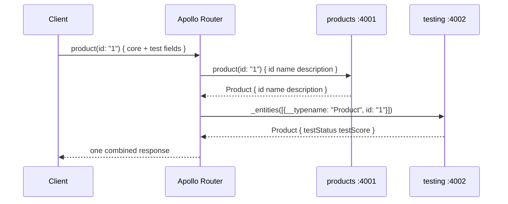

# Federation Internals

## What is running in this repository

This repository currently has two independently running subgraphs:

- `products`: root `schema.graphql`, `src/index.ts`, and `src/resolvers/`; local port `4001`.
- `testing`: `testing/schema.graphql`, `testing/src/index.ts`, and `testing/src/resolvers/`; local port `4002`.

Apollo Router is the client-facing GraphQL endpoint. Locally, `rover dev` reads
`supergraph.yaml`, composes both schema files, starts Router, and routes requests
to the two local HTTP services.

## Why `testing` is not visible in Apollo Studio

Apollo Studio is not a process discovery tool. It does not scan localhost and it
does not infer subgraphs from a local `supergraph.yaml`.

The local setup is:

```text
schema files + local routing URLs
              |
              v
       rover dev composition
              |
              v
      local Apollo Router
```

Studio sees a subgraph only after a schema is published to a GraphOS graph
variant. A production setup needs a graph reference such as
`my-graph@staging` or `my-graph@prod`, a registered subgraph name, a schema, and
a reachable routing URL. This repository currently has no `.env` containing an
`APOLLO_GRAPH_REF`, so it is not configured for GraphOS publication.

Publishing a schema is also separate from deploying a server. Studio can know
that a `testing` subgraph exists while Router cannot reach it, or Router can
reach a service whose schema was never registered correctly. Production must
validate both the registry contract and the deployed endpoint.

## Runtime request flow

For this operation:

```graphql
query ProductWithTestFields {
  product(id: "1") {
    id
    name
    description
    testStatus
    testScore
  }
}
```

1. The client sends one request to Router, not directly to a subgraph.
2. Router validates the operation against the composed supergraph schema.
3. Router creates a query plan. The first fetch asks `products` for `Product`'s
   key and core fields.
4. Router creates an entity representation such as
   `{ "__typename": "Product", "id": "1" }`.
5. Router sends that representation to `testing` through the federation
   `_entities` mechanism.
6. `testing` runs `Product.__resolveReference` and resolves `testStatus` and
   `testScore`.
7. Router joins the responses and returns one GraphQL response to the client.

An operation containing only `testProducts` is simpler: Router sends the whole
operation to `testing` and returns its response. Router does not merge arbitrary
JSON; it follows ownership and entity metadata produced during composition.

## Composition versus routing

Composition happens before serving traffic. It checks whether the subgraph SDLs
can form one valid federated schema and produces the supergraph representation.
Routing happens for every request. Router uses that composed representation to
choose subgraphs and construct a query plan.



## What a schema change means

A schema change is a contract change, even when the resolver implementation is
small. The safe path is:

1. Edit the owning subgraph SDL.
2. Update resolver code, generated types, and tests.
3. Run local subgraph tests and composition.
4. Publish the changed subgraph schema to a non-production graph variant.
5. Let GraphOS checks compare the proposed schema with operations observed in
   that variant. Fix composition errors, breaking changes, or contract warnings.
6. Deploy the matching subgraph service.
7. Confirm the registered routing URL reaches the deployed service and that the
   service exposes the published contract.
8. Promote the schema and service through staging and production using the same
   immutable build artifact.
9. Monitor Router query plans, errors, latency, and subgraph health.

Changing only a local schema file changes neither Studio nor a production
Router. Publishing only a schema changes neither the deployed service nor the
runtime response. Both artifacts must move together.

## Federation ownership rules in this repository

`products` owns the `Product` fields `id`, `name`, and `description`. It declares
`Product @key(fields: "id")`.

`testing` does not redefine those fields. It extends `Product`, marks `id` as
`@external`, and owns `testStatus` and `testScore`. This avoids duplicate field
ownership and gives Router enough information to perform an entity fetch.
