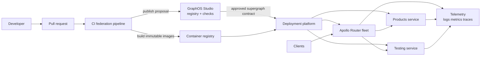

# Production Federation Platform

This document turns the current local example into a production architecture.
The central idea is to treat the GraphQL schema, subgraph service, Router
configuration, and operational signals as one release system.

## Target architecture

## Responsibilities

### GraphOS Studio

Use Studio as the schema registry and contract review system. It should own:

- Graph identity and variants such as `dev`, `staging`, and `prod`.
- Registered subgraph names and routing URLs.
- Composition checks and schema checks.
- Operation-aware breaking-change detection.
- Published schema history and auditability.

Studio is not the runtime Router and is not a replacement for service
health-checks or deployment orchestration.

### Apollo Router

Run Router as a stateless, horizontally scalable gateway. It should:

- Be the only public GraphQL endpoint.
- Load a known-good supergraph schema.
- Use private network connectivity to subgraphs.
- Enforce authentication, authorization boundaries, request limits, and timeouts.
- Emit structured logs, metrics, traces, and query-plan telemetry.
- Avoid depending on a developer laptop or mutable local schema files.

### Subgraphs

Each subgraph should have a clear domain owner and an independently deployable
service. A subgraph owns fields, data access, authorization decisions, and
runtime SLOs for its domain. It should expose a health endpoint and a versioned,
repeatable build artifact.

## Recommended change pipeline

### 1. Design

Decide which subgraph owns the new field. Do not add a field to whichever
service is easiest to edit. Ownership should follow the domain that can enforce
its correctness and authorization.

For an entity extension, agree on:

- Entity key and identity stability.
- Field ownership.
- Nullability and backward compatibility.
- `@requires` or `@provides` requirements, if any.
- Authorization and data sensitivity.
- Expected query and latency impact.

### 2. Implement

Change the SDL, resolver, generated types, and focused tests in the owning
subgraph. Keep schema and runtime behavior in the same pull request. Add a
contract test for the operation clients are expected to run.

### 3. Validate in CI

A federation pipeline should run, in order:

1. Formatting, linting, type checking, and unit tests.
2. Subgraph schema validation.
3. Composition against the target variant.
4. GraphOS schema checks for breaking changes and operation compatibility.
5. Container image build and vulnerability scan.
6. Integration tests against the candidate subgraph and Router.
7. Deployment manifest validation.

A failed composition or breaking-change check should block promotion.

### 4. Publish and promote

Use a short-lived proposal or check against `staging` before publishing to
`prod`. Publish the exact schema artifact produced by CI, rather than rebuilding
it manually from a developer workstation.

Deploy the service image and the Router/supergraph artifact with a controlled
rollout. The schema registered in GraphOS and the service version deployed at
its routing URL must be compatible during the rollout window.

### 5. Operate

Measure the system at three levels:

- Router: request rate, errors, latency, query planning, limits, and saturation.
- Subgraph: availability, dependency latency, errors, pool saturation, and
  resolver-level failures.
- Contract: composition status, schema checks, field usage, and deprecated field
  adoption.

Define rollback for both the service and the schema. A schema rollback that is
not supported by the deployed service is not a safe rollback.

## Important decisions to make

### GraphOS versus fully local composition

Use local `rover dev` for fast feedback. Use GraphOS variants and checks as the
source of truth for shared environments and production. They solve different
problems and should coexist.

### Managed Router versus self-hosted Router

A managed Router reduces operational ownership. A self-hosted Router provides
network, deployment, and policy control. Choose based on compliance, traffic
shape, platform maturity, and the team's willingness to operate the gateway.

### Supergraph delivery

Prefer an immutable, versioned supergraph artifact or a controlled managed
configuration update. Do not let production Router instances independently
compose arbitrary live subgraph schemas at startup.

### Subgraph deployment model

Start with one independently deployable service per domain. A monorepo is fine;
shared deployment does not make two modules a federation boundary. Keep service
ports, health checks, ownership, and release versions explicit.

### Security boundary

Treat Router as the public policy enforcement point, but do not trust it as the
only authorization layer. Subgraphs must authorize access to their own data,
especially when they can be reached through internal network paths.

### Testing strategy

Keep unit tests close to each subgraph. Add composition tests for schema
contracts. Add Router integration tests for multi-subgraph query plans. Add
production-like smoke tests for authentication, timeouts, partial failures, and
observability.

## Minimum production readiness checklist

- [ ] Every subgraph has a domain owner and an explicit field ownership map.
- [ ] GraphOS variants exist for development, staging, and production.
- [ ] CI runs composition and schema checks before deployment.
- [ ] Production Router never reads developer-local schema files.
- [ ] Subgraph routing URLs are private, authenticated where appropriate, and
      health-checked.
- [ ] Router and subgraphs have timeouts, retry policy, rate limits, and request
      size limits.
- [ ] Authentication and authorization are tested at Router and subgraph layers.
- [ ] Logs, metrics, traces, and correlation IDs are available end to end.
- [ ] Schema and service rollback procedures are documented and tested.
- [ ] Field usage and deprecation policy are reviewed regularly.

## Practical next decisions for this repository

1. Create a GraphOS graph and choose variant names, starting with `staging`.
2. Register `products` and `testing` as subgraphs in that graph.
3. Decide whether `testing` is a permanent domain or only a local fixture
   subgraph. A production fixture service should not accidentally become a
   public data source.
4. Add CI credentials through the secret store, never into `.env` committed to
   the repository.
5. Choose where Router and the two services will run, then define private
   service discovery and health-check behavior.
6. Add a proposal/check step before any production schema publish.
7. Add Router-level integration tests for the federated `Product` query.
